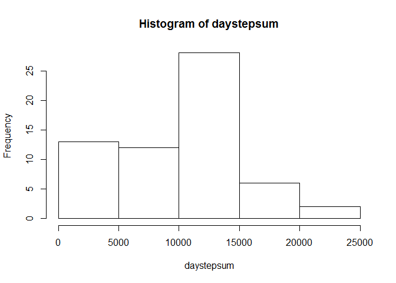
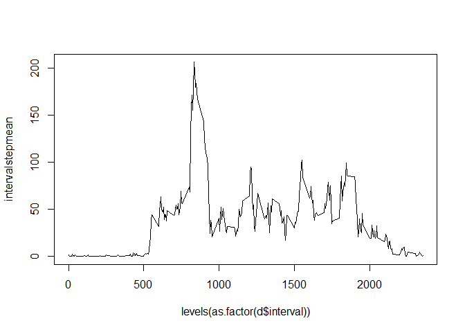
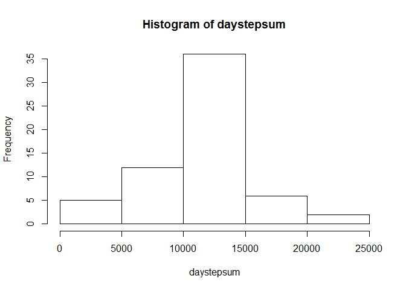
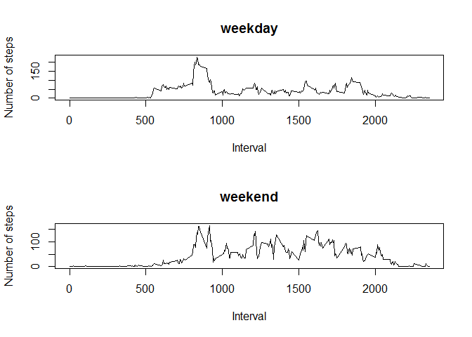

# Reproducible Research: Peer Assessment 1


## Loading and preprocessing the data


```r
ab <- unzip("activity.zip")
d <- read.csv(ab, header = TRUE)

#d$date <- as.Date(as.character(d$date))
```

## What is mean total number of steps taken per day?

```r
#levels(d$date)
daystepmean <- vector(mode ="numeric", length = length(levels(d$date)) )
daystepsum <- vector(mode ="numeric", length = length(levels(d$date)) )
daystepmedian <- vector(mode ="integer", length = length(levels(d$date)) )
for (i in 1:length(levels(d$date)))
        {daystepmean[i] <- mean(d$steps[d$date == levels(d$date)[i]], na.rm =TRUE)
         daystepsum[i] <- sum(d$steps[d$date == levels(d$date)[i]], na.rm =TRUE)
        daystepmedian[i] <- median(d$steps[d$date == levels(d$date)[i]], na.rm =TRUE)}
hist(daystepsum)
```

 

```r
meanmediantable <- cbind(levels(d$date), daystepmean, daystepmedian, daystepsum)
meanmediantable
```

```
##                    daystepmean         daystepmedian daystepsum
##  [1,] "2012-10-01" "NaN"               NA            "0"       
##  [2,] "2012-10-02" "0.4375"            "0"           "126"     
##  [3,] "2012-10-03" "39.4166666666667"  "0"           "11352"   
##  [4,] "2012-10-04" "42.0694444444444"  "0"           "12116"   
##  [5,] "2012-10-05" "46.1597222222222"  "0"           "13294"   
##  [6,] "2012-10-06" "53.5416666666667"  "0"           "15420"   
##  [7,] "2012-10-07" "38.2465277777778"  "0"           "11015"   
##  [8,] "2012-10-08" "NaN"               NA            "0"       
##  [9,] "2012-10-09" "44.4826388888889"  "0"           "12811"   
## [10,] "2012-10-10" "34.375"            "0"           "9900"    
## [11,] "2012-10-11" "35.7777777777778"  "0"           "10304"   
## [12,] "2012-10-12" "60.3541666666667"  "0"           "17382"   
## [13,] "2012-10-13" "43.1458333333333"  "0"           "12426"   
## [14,] "2012-10-14" "52.4236111111111"  "0"           "15098"   
## [15,] "2012-10-15" "35.2048611111111"  "0"           "10139"   
## [16,] "2012-10-16" "52.375"            "0"           "15084"   
## [17,] "2012-10-17" "46.7083333333333"  "0"           "13452"   
## [18,] "2012-10-18" "34.9166666666667"  "0"           "10056"   
## [19,] "2012-10-19" "41.0729166666667"  "0"           "11829"   
## [20,] "2012-10-20" "36.09375"          "0"           "10395"   
## [21,] "2012-10-21" "30.6284722222222"  "0"           "8821"    
## [22,] "2012-10-22" "46.7361111111111"  "0"           "13460"   
## [23,] "2012-10-23" "30.9652777777778"  "0"           "8918"    
## [24,] "2012-10-24" "29.0104166666667"  "0"           "8355"    
## [25,] "2012-10-25" "8.65277777777778"  "0"           "2492"    
## [26,] "2012-10-26" "23.5347222222222"  "0"           "6778"    
## [27,] "2012-10-27" "35.1354166666667"  "0"           "10119"   
## [28,] "2012-10-28" "39.7847222222222"  "0"           "11458"   
## [29,] "2012-10-29" "17.4236111111111"  "0"           "5018"    
## [30,] "2012-10-30" "34.09375"          "0"           "9819"    
## [31,] "2012-10-31" "53.5208333333333"  "0"           "15414"   
## [32,] "2012-11-01" "NaN"               NA            "0"       
## [33,] "2012-11-02" "36.8055555555556"  "0"           "10600"   
## [34,] "2012-11-03" "36.7048611111111"  "0"           "10571"   
## [35,] "2012-11-04" "NaN"               NA            "0"       
## [36,] "2012-11-05" "36.2465277777778"  "0"           "10439"   
## [37,] "2012-11-06" "28.9375"           "0"           "8334"    
## [38,] "2012-11-07" "44.7326388888889"  "0"           "12883"   
## [39,] "2012-11-08" "11.1770833333333"  "0"           "3219"    
## [40,] "2012-11-09" "NaN"               NA            "0"       
## [41,] "2012-11-10" "NaN"               NA            "0"       
## [42,] "2012-11-11" "43.7777777777778"  "0"           "12608"   
## [43,] "2012-11-12" "37.3784722222222"  "0"           "10765"   
## [44,] "2012-11-13" "25.4722222222222"  "0"           "7336"    
## [45,] "2012-11-14" "NaN"               NA            "0"       
## [46,] "2012-11-15" "0.142361111111111" "0"           "41"      
## [47,] "2012-11-16" "18.8923611111111"  "0"           "5441"    
## [48,] "2012-11-17" "49.7881944444444"  "0"           "14339"   
## [49,] "2012-11-18" "52.4652777777778"  "0"           "15110"   
## [50,] "2012-11-19" "30.6979166666667"  "0"           "8841"    
## [51,] "2012-11-20" "15.5277777777778"  "0"           "4472"    
## [52,] "2012-11-21" "44.3993055555556"  "0"           "12787"   
## [53,] "2012-11-22" "70.9270833333333"  "0"           "20427"   
## [54,] "2012-11-23" "73.5902777777778"  "0"           "21194"   
## [55,] "2012-11-24" "50.2708333333333"  "0"           "14478"   
## [56,] "2012-11-25" "41.0902777777778"  "0"           "11834"   
## [57,] "2012-11-26" "38.7569444444444"  "0"           "11162"   
## [58,] "2012-11-27" "47.3819444444444"  "0"           "13646"   
## [59,] "2012-11-28" "35.3576388888889"  "0"           "10183"   
## [60,] "2012-11-29" "24.46875"          "0"           "7047"    
## [61,] "2012-11-30" "NaN"               NA            "0"
```


## What is the average daily activity pattern?


```r
intervalstepmean <- vector(mode ="numeric", length = length(levels(as.factor(d$interval))))

for (i in 1:length(levels(as.factor(d$interval))))
        {intervalstepmean[i] <- mean(d$steps[as.factor(d$interval) == levels(as.factor(d$interval))[i]], na.rm =TRUE) }
#intervalstepmean <<- intervalstepmean
plot(levels(as.factor(d$interval)), intervalstepmean, type ="l")
```

 

```r
maxinterval <-levels(as.factor(d$interval))[which(intervalstepmean == max(intervalstepmean))]
maxinterval
```

```
## [1] "835"
```

## Imputing missing values
# imputation was performed by replacing missing values with the interval mean


```r
intervalstepmean <- vector(mode ="numeric", length = length(levels(as.factor(d$interval))))

for (i in 1:length(levels(as.factor(d$interval))))
        {intervalstepmean[i] <- mean(d$steps[as.factor(d$interval) == levels(as.factor(d$interval))[i]], na.rm =TRUE) }

numberofmissingvalues <-sum(is.na(d$steps))
rowsna <- which(is.na(d$steps))
for (j in 1:numberofmissingvalues)
        {rowd <- rowsna[j]
       d$steps[rowd] <- intervalstepmean[which(levels(as.factor(d$interval))== d$interval[rowd])]      }


daystepmean <- vector(mode ="numeric", length = length(levels(d$date)) )
daystepsum <- vector(mode ="numeric", length = length(levels(d$date)) )
daystepmedian <- vector(mode ="integer", length = length(levels(d$date)) )
for (i in 1:length(levels(d$date)))
        {daystepmean[i] <- mean(d$steps[d$date == levels(d$date)[i]], na.rm =TRUE)
         daystepsum[i] <- sum(d$steps[d$date == levels(d$date)[i]], na.rm =TRUE)
        daystepmedian[i] <- median(d$steps[d$date == levels(d$date)[i]], na.rm =TRUE)}
hist(daystepsum)
```

 

```r
meanmediantable <- cbind(levels(d$date), daystepmean, daystepmedian, daystepsum)
meanmediantable
```

```
##                    daystepmean         daystepmedian     
##  [1,] "2012-10-01" "37.3825995807128"  "34.1132075471698"
##  [2,] "2012-10-02" "0.4375"            "0"               
##  [3,] "2012-10-03" "39.4166666666667"  "0"               
##  [4,] "2012-10-04" "42.0694444444444"  "0"               
##  [5,] "2012-10-05" "46.1597222222222"  "0"               
##  [6,] "2012-10-06" "53.5416666666667"  "0"               
##  [7,] "2012-10-07" "38.2465277777778"  "0"               
##  [8,] "2012-10-08" "37.3825995807128"  "34.1132075471698"
##  [9,] "2012-10-09" "44.4826388888889"  "0"               
## [10,] "2012-10-10" "34.375"            "0"               
## [11,] "2012-10-11" "35.7777777777778"  "0"               
## [12,] "2012-10-12" "60.3541666666667"  "0"               
## [13,] "2012-10-13" "43.1458333333333"  "0"               
## [14,] "2012-10-14" "52.4236111111111"  "0"               
## [15,] "2012-10-15" "35.2048611111111"  "0"               
## [16,] "2012-10-16" "52.375"            "0"               
## [17,] "2012-10-17" "46.7083333333333"  "0"               
## [18,] "2012-10-18" "34.9166666666667"  "0"               
## [19,] "2012-10-19" "41.0729166666667"  "0"               
## [20,] "2012-10-20" "36.09375"          "0"               
## [21,] "2012-10-21" "30.6284722222222"  "0"               
## [22,] "2012-10-22" "46.7361111111111"  "0"               
## [23,] "2012-10-23" "30.9652777777778"  "0"               
## [24,] "2012-10-24" "29.0104166666667"  "0"               
## [25,] "2012-10-25" "8.65277777777778"  "0"               
## [26,] "2012-10-26" "23.5347222222222"  "0"               
## [27,] "2012-10-27" "35.1354166666667"  "0"               
## [28,] "2012-10-28" "39.7847222222222"  "0"               
## [29,] "2012-10-29" "17.4236111111111"  "0"               
## [30,] "2012-10-30" "34.09375"          "0"               
## [31,] "2012-10-31" "53.5208333333333"  "0"               
## [32,] "2012-11-01" "37.3825995807128"  "34.1132075471698"
## [33,] "2012-11-02" "36.8055555555556"  "0"               
## [34,] "2012-11-03" "36.7048611111111"  "0"               
## [35,] "2012-11-04" "37.3825995807128"  "34.1132075471698"
## [36,] "2012-11-05" "36.2465277777778"  "0"               
## [37,] "2012-11-06" "28.9375"           "0"               
## [38,] "2012-11-07" "44.7326388888889"  "0"               
## [39,] "2012-11-08" "11.1770833333333"  "0"               
## [40,] "2012-11-09" "37.3825995807128"  "34.1132075471698"
## [41,] "2012-11-10" "37.3825995807128"  "34.1132075471698"
## [42,] "2012-11-11" "43.7777777777778"  "0"               
## [43,] "2012-11-12" "37.3784722222222"  "0"               
## [44,] "2012-11-13" "25.4722222222222"  "0"               
## [45,] "2012-11-14" "37.3825995807128"  "34.1132075471698"
## [46,] "2012-11-15" "0.142361111111111" "0"               
## [47,] "2012-11-16" "18.8923611111111"  "0"               
## [48,] "2012-11-17" "49.7881944444444"  "0"               
## [49,] "2012-11-18" "52.4652777777778"  "0"               
## [50,] "2012-11-19" "30.6979166666667"  "0"               
## [51,] "2012-11-20" "15.5277777777778"  "0"               
## [52,] "2012-11-21" "44.3993055555556"  "0"               
## [53,] "2012-11-22" "70.9270833333333"  "0"               
## [54,] "2012-11-23" "73.5902777777778"  "0"               
## [55,] "2012-11-24" "50.2708333333333"  "0"               
## [56,] "2012-11-25" "41.0902777777778"  "0"               
## [57,] "2012-11-26" "38.7569444444444"  "0"               
## [58,] "2012-11-27" "47.3819444444444"  "0"               
## [59,] "2012-11-28" "35.3576388888889"  "0"               
## [60,] "2012-11-29" "24.46875"          "0"               
## [61,] "2012-11-30" "37.3825995807128"  "34.1132075471698"
##       daystepsum        
##  [1,] "10766.1886792453"
##  [2,] "126"             
##  [3,] "11352"           
##  [4,] "12116"           
##  [5,] "13294"           
##  [6,] "15420"           
##  [7,] "11015"           
##  [8,] "10766.1886792453"
##  [9,] "12811"           
## [10,] "9900"            
## [11,] "10304"           
## [12,] "17382"           
## [13,] "12426"           
## [14,] "15098"           
## [15,] "10139"           
## [16,] "15084"           
## [17,] "13452"           
## [18,] "10056"           
## [19,] "11829"           
## [20,] "10395"           
## [21,] "8821"            
## [22,] "13460"           
## [23,] "8918"            
## [24,] "8355"            
## [25,] "2492"            
## [26,] "6778"            
## [27,] "10119"           
## [28,] "11458"           
## [29,] "5018"            
## [30,] "9819"            
## [31,] "15414"           
## [32,] "10766.1886792453"
## [33,] "10600"           
## [34,] "10571"           
## [35,] "10766.1886792453"
## [36,] "10439"           
## [37,] "8334"            
## [38,] "12883"           
## [39,] "3219"            
## [40,] "10766.1886792453"
## [41,] "10766.1886792453"
## [42,] "12608"           
## [43,] "10765"           
## [44,] "7336"            
## [45,] "10766.1886792453"
## [46,] "41"              
## [47,] "5441"            
## [48,] "14339"           
## [49,] "15110"           
## [50,] "8841"            
## [51,] "4472"            
## [52,] "12787"           
## [53,] "20427"           
## [54,] "21194"           
## [55,] "14478"           
## [56,] "11834"           
## [57,] "11162"           
## [58,] "13646"           
## [59,] "10183"           
## [60,] "7047"            
## [61,] "10766.1886792453"
```
# it appears there is significant  differences from imputing missing values
# the total number of daily steps increases
## Are there differences in activity patterns between weekdays and weekends?


```r
#d$date <- as.Date(d$date)
daysofweek <- weekdays(as.Date(d$date))
for (k in 1:length(d$date))
        {if (daysofweek[k] == "Sunday" | daysofweek[k] == "Saturday")
                     {daysofweek[k] <- "weekend"}
             else
                     {daysofweek[k] <- "weekday"}
             }
library(dplyr)
```

```
## 
## Attaching package: 'dplyr'
## 
## The following object is masked from 'package:stats':
## 
##     filter
## 
## The following objects are masked from 'package:base':
## 
##     intersect, setdiff, setequal, union
```

```r
 d2<- mutate(d, daysofweek)
d2$daysofweek <- as.factor(d2$daysofweek)
weekdaydata <- filter(d2, daysofweek == "weekday")
weekenddata <- filter(d2, daysofweek == "weekend")

weekdayintervalstepmean <- vector(mode ="numeric", length = length(levels(as.factor(d$interval))))

for (i in 1:length(levels(as.factor(weekdaydata$interval))))
        {weekdayintervalstepmean[i] <- mean(weekdaydata$steps[as.factor(weekdaydata$interval) == levels(as.factor(weekdaydata$interval))[i]], na.rm =TRUE) }

weekendintervalstepmean <- vector(mode ="numeric", length = length(levels(as.factor(d$interval))))

for (i in 1:length(levels(as.factor(weekenddata$interval))))
        {weekendintervalstepmean[i] <- mean(weekenddata$steps[as.factor(weekenddata$interval) == levels(as.factor(weekenddata$interval))[i]], na.rm =TRUE) }

 par(mfrow = c(2, 1))
plot(levels(as.factor(d$interval)), weekdayintervalstepmean, type ="l", xlab ="Interval", ylab = "Number of steps", main = "weekday")
plot(levels(as.factor(d$interval)), weekendintervalstepmean, type ="l", xlab ="Interval", ylab = "Number of steps", main = "weekend")
```

 
